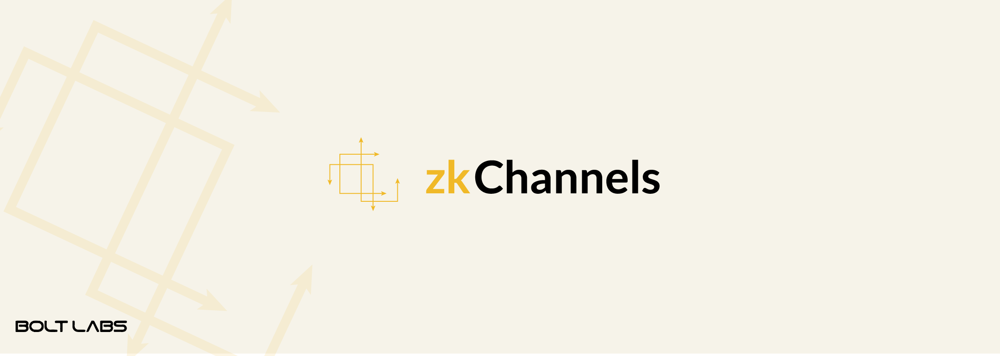
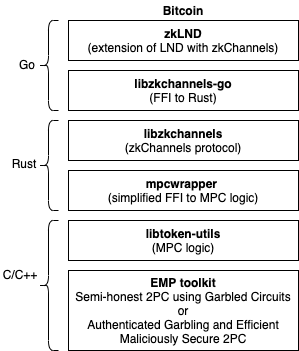

# libzkchannels

A Rust library implementation of libzkchannels (formerly BOLT: Blind Off-chain Lightweight Transactions).

zkChannels is a system for conducting **privacy-preserving off-chain payments** between pairs of individual parties. The protocol is designed to enable privacy-preserving cryptocurrencies on top of Bitcoin (via MPC) and Zcash (via ZK proofs), by allowing individuals to establish and use payment channels for instantaneous payments that do not require an on-chain transaction.

## <a name='TableofContents'></a>Table of Contents

1. [Install Rust](#installing-rust)
2. [Build & Install](#build--install)
3. [Run Tests](#tests)
4. [zkChannels API](#2-build-guide)
    * [Using ZK Proof techniques](#payment-channels-using-zk-proof-techniques)
    * [Using MPC techniques](#payment-channels-using-mpc-techniques)	
5. [Guide for MPC](#compile-mpc-with-malicious-security)
    * [Performance](#performance-in-malicious-security)

# WARNING

The libzkchannels library is a proof of concept implementation that relies on experimental libraries and dependencies at the moment. It is not suitable for production software yet.

# Major Dependencies

* secp256k1
* ff
* pairing
* serde, serde_json
* sha2, ripemd160, hmac, hex
* wagyu-bitcoin and wagyu-zcash
* redis

Note that the above rust dependencies will be compiled and installed as a result of running the `make` command.

# Installing Rust

 To install Rust, we recommend using [rustup](https://www.rustup.rs/). You can install `rustup` on macOS or Linux as follows:

   ```bash
   curl --proto '=https' --tlsv1.2 -sSf https://sh.rustup.rs | sh
   ```

# Build & Install

To be able to build libzkchannels, we require that you install the EMP-toolkit and other dependencies as follows:

	. ./env
	make deps
	./test_emp.sh

In addition, you'll need to start the Redis database service as follows:

	./setup_redis.sh

To build libzkchannels and execute all unit tests, run `make`

# Tests

To run just the libzkchannels unit tests, run `make test` and for MPC-only tests, run `make mpctest`

# Usage

To use the libzkchannels library, add the `libzkchannels` crate to your dependency file in `Cargo.toml` as follows:

```toml
[dependencies]
zkchannels = "0.4.0"
```

Then add an extern declaration at the root of your crate as follows:
```rust
extern crate zkchannels;
```

# zkChannels API

The libzkchannels library provides APIs for anonymous bidirectional payment channels based on two kinds of techniques to provide privacy:

* ZK: Non-interactive Zero-knowledge proofs
* MPC: Secure multi-party computation (or 2PC)

zkChannels allow a customer and a merchant to exchange arbitrary positive and negative amounts.

## Payment Channels using ZK Proof techniques

We now describe the construction based on ZK proofs.

### Channel Setup and Key Generation

The first part of setting up bi-directional payment channels involve generating initial setup parameters using curve BLS12-381 with channel state.

	use zkchannels::zkproofs;

	// generate the initial channel state
	// second argument represents third-party mode
	let mut channel_state = zkproofs::ChannelState::<Bls12>::new(String::from("Channel A -> B"), false);
	let mut rng = &mut rand::thread_rng();

	// generate fresh public parameters
	channel_state.setup(&mut rng);

### Initialization

To initialize state/keys for both parties, call the ``zkproofs::init_merchant()`` and ``zkproofs::init_customer()``:

	let b0_merch = 10;
	let b0_cust = 100;

	// initialize the merchant state and initialize with balance
	let (mut channel_token, mut merch_state, mut channel_state) = zkproofs::init_merchant(rng, &mut channel_state, "Bob");

	// generate the customer state using the channel token from the merchant
	let mut cust_state = zkproofs::init_customer(rng, // rng
	                                              &mut channel_token, // channel token
	                                              b0_cust, // init customer balance
	                                              b0_merch, // init merchant balance
	                                              "Alice")); // channel name/purpose


### Establish Protocol

When opening a payment channel, execute the establishment protocol API to escrow funds privately as follows:

	// establish the channel by generating initial state commitment proof
	let (com, com_proof) = zkproofs::establish_customer_generate_proof(rng, &mut channel_token, &mut cust_state);

	// obtain close token for closing out channel
	let close_token = zkproofs::establish_merchant_issue_close_token(rng, &channel_state, &com, &com_proof, &merch_state);

	// customer verifies that close-token
	assert!(cust_state.verify_close_token(&channel_state, &close_token));

	// form funding tx and wait for network confirmation

	// obtain payment token after confirming funding tx
	let pay_token = zkproofs::establish_merchant_issue_pay_token(rng, &channel_state, &com, &merch_state);

	// customer
	assert!(zkproofs::establish_final(&mut channel_state, &mut cust_state, &pay_token));

	// confirm that the channel state is now established
	assert!(channel_state.channel_established);

### Pay protocol

To spend on the channel, execute the pay protocol API (can be executed as many times as necessary):

	// phase 1 - payment proof and new cust state
	let (payment, new_cust_state) = zkproofs::generate_payment_proof(rng, &channel_state, &cust_state, 10);

	// phase 1 - merchant verifies the payment proof and returns a close-token
	let new_close_token = zkproofs::verify_payment_proof(rng, &channel_state, &payment, &mut merch_state);

	// phase 2 - verify the close-token, update cust state and generate a revoke token for previous cust state state
	let revoke_token = zkproofs::generate_revoke_token(&channel_state, &mut cust_state, new_cust_state, &new_close_token);

	// phase 2 - merchant verifies the revoke token and sends back the pay-token in response
	let new_pay_token = zkproofs::verify_revoke_token(&revoke_token, &mut merch_state);

	// final - customer verifies the pay token and updates internal state
	assert!(cust_state.verify_pay_token(&channel_state, &new_pay_token));

### Channel Closure

To close a channel, the customer must execute the `zkproofs::customer_close()` routine as follows:

	let cust_close_msg = zkproofs::customer_close(&channel_state, &cust_state);

If the customer broadcasts an outdated version of his state, then the merchant can dispute this claim by executing the `zkproofs::merchant_close()` routine as follows:

	let merch_close = zkproofs::merchant_close(&channel_state, &channel_token, &cust_close_msg, &merch_state);

## Third-party Payments

The bidirectional payment channels can be used to construct third-party payments in which a party **A** pays a second party **B** through an untrusted intermediary (**I**) to which both **A** and **B** have already established a channel. With BOLT, the intermediary learns nothing about the payment from **A** to **B** and cannot link transactions to individual users.

To enable third-party payment support, initialize each payment channel as follows:

	// create the channel state for each channel and indicate third-party support
	let mut channel_state = zkproofs::ChannelState::<Bls12>::new(String::from("Third-party Channels"), true);

Moreover, the intermediary can set a channel fee as follows:

	channel_state.set_channel_fee(5);

The channel establishment still works as described before and the pay protocol includes an additional step to verify that the payments on both channels cancel out or include a channel fee (if specified).


	...

	let payment_amount = 20;
	// get payment proof on first channel with party A and H
	let (sender_payment, new_cust_stateA) = zkproofs::generate_payment_proof(rng, &channel_state,
                                                                                 &cust_stateA,
                                                                                 payment_amount); // bal inc
	// get payment proof on second channel with party B and H
	let (receiver_payment, new_cust_stateB) = zkproofs::generate_payment_proof(rng, &channel_state,
                                                                                   &cust_stateB,
                                                                                   -payment_amount); // bal dec

	// intermediary executes the following on the two payment proofs
	// verifies that the payment proof is valid & cancels out and results in hub's fee
	let close_token_result = zkproofs::verify_multiple_payment_proofs(rng, &channel_state,
                                                                          &sender_payment,
                                                                          &receiver_payment,
                                                                          &mut merch_state);

	// alice gets a close token and bob gets a conditional token which requires alice's revoke token to be valid
	let (alice_close_token, bob_cond_close_token) = handle_bolt_result!(close_token_result).unwrap();

	// both alice and bob generate a revoke token
	let revoke_token_alice = zkproofs::generate_revoke_token(&channel_state,
                                                                 &mut cust_stateA,
                                                                 new_cust_stateA,
                                                                 &alice_close_token);
	let revoke_token_bob = zkproofs::generate_revoke_token(&channel_state,
                                                               &mut cust_stateB,
                                                               new_cust_stateB,
                                                               &bob_cond_close_token);

	// send both revoke tokens to intermediary and receive pay-tokens (one for sender and another for receiver)
	let new_pay_tokens: BoltResult<(cl::Signature<Bls12>,cl::Signature<Bls12>)> = \
                          zkproofs::verify_multiple_revoke_tokens(&revoke_token_sender,
                                                                     &revoke_token_receiver,
                                                                     &mut merch_state);

	...

See the `intermediary_payment_basics_works()` unit test in `src/lib.rs` for more details.

## Payment Channels using MPC techniques

We now describe the APIs around our support for non-anonymous currencies like Bitcoin.



### Channel Setup

	use zkchannels::mpc;

	// create initial channel mpc state
	let mut channel_state = mpc::ChannelMPCState::new(String::from("Channel A -> B"), false);

### Initialize & Establish

	let cust_bal = 100;
	let merch_bal = 100;

	// merchant initializes state for all channels it will open with customers
	let mut merch_state = mpc::init_merchant(&mut rng, &mut channel_state, "Bob");

	// customer initializes state for channel with initial balances
	let (channel_token, mut cust_state) = mpc::init_customer(&mut rng, &merch_state.pk_m, cust_bal, merch_bal, "Alice");

	// form all the transactions: <escrow-tx> and <merch-close-tx>

	// customer gets the initial state of the channel and
	let (init_cust_state, init_hash) = mpc::get_initial_state(&cust_state).unwrap();

	// merchant validates the initial state
	let res = mpc::validate_initial_state(&channel_token, &init_cust_state, init_hash, &mut merch_state);

	// at this point, both parties proceed with exchanging signatures on their respective closing transactions
	// customer gets two signed closing transactions from merchant that issues a refund back to customer
	// merchant gets a signed <merch-close-tx> that locks up the channel balance to another timelocked multi-sig

	// customer signs & broadcasts <escrow-tx> to the blockchain
	// both parties wait for the network to confirm the txs

### Activate & Unlink

	// prepare to active the channel by generating initial rev lock commitment and initial randomness
	// returns the initial state of channel
	let old_state = mpc::activate_customer(&mut rng, &mut cust_state);

	// merchant returns an initial pay token for channel
	let pay_token = mpc::activate_merchant(channel_token, &old_state, &mut merch_state);

	// customer stores the initial pay token
	mpc::activate_customer_finalize(pay_token, &mut cust_state);

	// customer unlinks initial pay-token by running the following pay protocol with a 0-payment

### Pay Protocol

Prepare/Update State phase

	// customer prepares payment by generating a new state, new revocation lock and secret, and
	let (state, revoked_state) = mpc::pay_prepare_customer(&mut rng, &mut channel_state, 10, &mut cust_state).unwrap();
	let rev_lock_com = revoked_state.get_rev_lock_com();

	// merchant generates a pay token mask and return a commitment to the customer
	let pay_mask_com = mpc::pay_prepare_merchant(&mut rng, channel_state, rev_lock_com, old_state.get_nonce(), rev_lock_com, 10, &mut merch_state).unwrap();

Now proceed with executing the MPC if successful

	// customer executes mpc protocol with old/new state, pay mask commitment, rev lock commitment and payment amount
	let ok_cust = mpc::pay_update_customer(&mut channel_state, &channel_token, old_state, new_state, pay_mask_com, rev_lock_com, 10, &mut cust_state);

	// merchant executes mpc protocol with customer nonce, pay mask commitment, rev lock commitment and payment amount
	let ok_merch = mpc::pay_update_merchant(&mut rng, &mut channel_state, old_state.get_nonce(), pay_mask_com, rev_lock_com, 10, &mut merch_state);

	// customer sends success/error back to merchant if the customer obtains 3 masked outputs for both closing transactions and pay token

Unmask/Revoke phase

	// unmask the closing signatures on the current state (from MPC output)
	// and if signatures are valid, the customer sends the revoked state message
	let is_ok = mpc::pay_unmask_sigs_customer(masks, &mut cust_state);

	// merchant verifies that revoked message on the previous state if unmasking was successful
	let (pt_mask, pt_mask_r) = mpc::pay_validate_rev_lock_merchant(revoked_state, &mut merch_state).unwrap();

	// customer unmasks the pay token and checks validity of pay-token mask commitment opening
	let is_ok = mpc::pay_unmask_pay_token_customer(pt_mask, pt_mask_r, &mut cust_state);

### Close

Merchant can initiate channel closing with a signed merch-close-tx that pays full channel balance to a timelocked multi-sig:

	// merchant signs the merch-close-tx for the channel and combines with customer signature
	let (merch_signed_tx, txid) = mpc::merchant_close(&escrow_txid, &merch_state).unwrap();

Customer can similarly initiate channel closing with a signed cust-close-tx of current balances spending from escrow-tx (or merch-close-tx):

	// customer signs the current state of channel and combines with escrow signature (if spending from <escrow-tx>)
	let from_escrow = true;
	let (cust_signed_tx, txid) = mpc::customer_close(&channel_state, &channel_token, from_escrow, &cust_state).unwrap();

## Compile MPC with Malicious Security 

Our MPC can be instantiated in two possible ways: **semi-honest** or **malicious** model. We build for the semi-honest model by default for testing. However, you can enable zkChannels with malicious security as follows:

	export AG2PC=1
	cargo clean
	cargo build --release
	make mpctest

### Performance in Malicious Security

TODO: add numbers here

# Documentation

Build the api documentation by simply running `make doc`. Documentation will be generated in your local `target/doc` directory.

For the libzkchannels (or BOLT) design documentation, see the `docs/bolt.pdf` document.

# Contributions

To contribute code improvements, please checkout the repository, make your changes and submit a pull request.

	git clone https://github.com/boltlabs-inc/libzkchannels.git

# License

Licensed under MIT (LICENSE-MIT or http://opensource.org/licenses/MIT)
