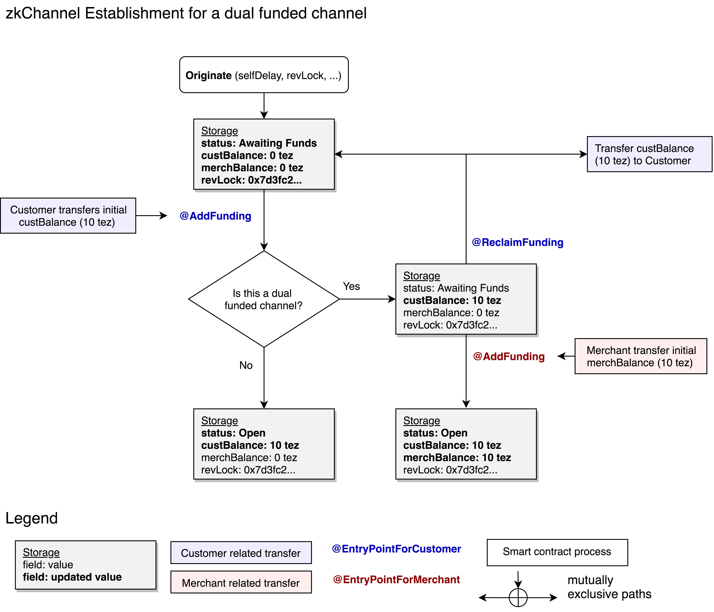
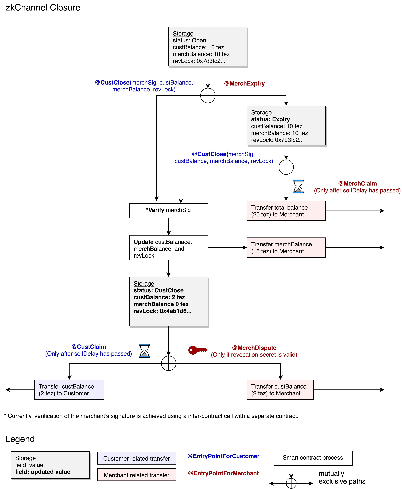

# zkChannels smart contract design and entrypoints

## Origination and Funding

The following figure illustrates the entrypoints and transactions used in a dual funded channel. In this example, a channel designed to hold a total of 20 tez, with 10 tez coming from the customer and 10 tez coming from the merchant. If it were a single funded channel, only the customer would need to add funds.


<br><br>

The first step is originating the zkchannel smart contract on chain. Anyone can perform this step and doing so incurs some gas cost. The fields within the channel storage need to be specified at the time of creating the contract. These include:

```
chanID            = chanID,
custAddr          = custAddr,
merchAddr         = merchAddr,
custPk            = custPk,
merchPk           = merchPk,
custBal           = sp.tez(0),
merchBal          = sp.tez(0),
custFunding       = custFunding,
merchFunding      = merchFunding,
status            = sp.string('awaitingFunding'),
revLock           = revLock,
selfDelay         = selfDelay,
delayExpiry       = sp.timestamp(0)
```

#### `addFunding`

Once the contract has been originated, the customer (and merchant if it’s a dual funded channel) deposit their funds in to the contract via the addFunding entry point. The amount deposited needs to be equal to what was specified in `custFunding` or `merchFunding` in the storage during the contract origination. When the channel has been funded, the status field will change to `'open'`.

#### `reclaimFunding`

Allows the customer or merchant to withdraw funds if the other party has not funded their side of the channel yet

## Channel Closure

The following figure illustrates the possible ways a channel can be closed. In this example, a channel with a total of 20 tez is being closed on, where the final customer balance is 2 tez and the final merchant balance is 18 tez.


<br><br>

#### `merchClose`

While the channel status is `‘open’`, `merchClose` can be called by the merchant to initiate channel closure. In response, the customer should call `custClose` using the latest state. Otherwise, if the delay period expires, the merchant will be able to claim all the funds in the channel using `merchClaim`.

#### `merchClaim`

`merchClaim` can be called by the merchant if the customer has not called `custClose` before the delay period has expired.

#### `custClose`

Inputs: `revLock`, `newCustBal`, `newMerchBal`, `merchSig`

At any point while the channel is `'open'`, the customer can broadcast `custClose`, initiating channel closure with the latest balances approved by the merchant. If the customer tries to broadcast an outdated (revoked) balance, the merchant will be able to claim the customer's balance (in addition to their own) by calling `merchDispute` and providing the secret corresponding to `revLock`.

#### `merchDispute`

Input: `revSecret`

`merchDispute` can be called if the merchant has the secret corresponding to the `custClose` state in the smart contract storage. If the secret is valid, the merchant will receive the customer's balance too.

#### `custClaim`

`custClaim` can be called by the customer to claim their balance, but only after the delay period from `custClose` has expired.

#### `mutualClose`

Inputs: `channelID`, `custAddr`, `merchAddr`, `newCustBal`, `newMerchBal`, `custSig`, `merchSig`

mutualClose can be called by either the customer or the merchant and allows for an instant withdrawal of the funds. It requires a signature from the merchant and the customer on the final state.
